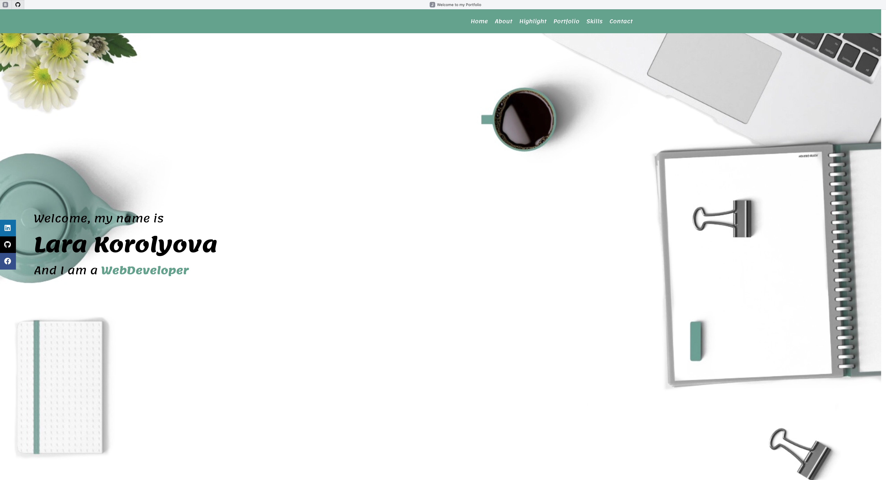
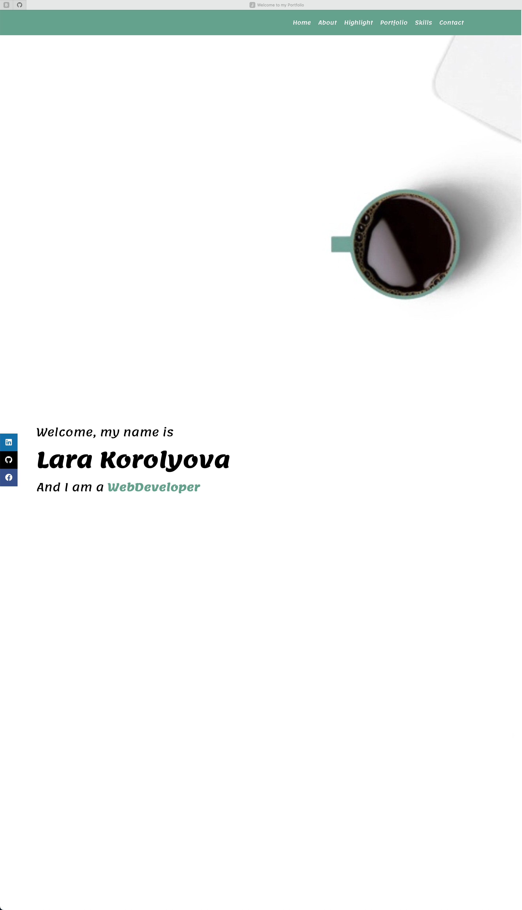

# My Beta Portfolio
* Coding Bootcamp - Assignment - Week 2 - Portfolio 

        Project Status - STILL IN PROGRESS 
 

## Table of Contents
* [General Info](#general-info)
* [Live URL](#live-url)
* [Walkthrough or What have done so far](#walkthrough)
* [Looking for some help](#Help-Me-Please)
* [Webpage Preview](#webpage-preview)
* [Contributing](#contributing)
* [Notes](#notes)

 

## General Info
This is my first attempt to build myself a portfolio. 
At the moment I don't have active applications or websites, so I used placeholder images.
This portfolio is  still "work in progress" and will be updated as my skills process.
 
PS: if you see any errors or maybe grammar mistakes - please let me know.
 
All recommendations, hints and comments are very welcome.

 

### Live URL
https://joyofcodinglife.github.io/Week2-A-Portfolio/

 

## Walkthrough
- Desing is simple (I believe) and nicely flowing into next sections.
- Navbar is sticky, with all links are working and changing color when hovered.
- Home screen is taking all space regardless of screen size.

 

## Please Help Me
1. Can't find why the sections' titles are showing over the navbar when scrolled.
2. Can't figure out why the layout is now responsive and doesn't adapt to screensize (I tried many varietions, and even restyled the sections over and over again).

 

### Webpage Preview
The following images show the web application's appearance.

 

## Contributing
Pull requests are welcome. For major changes, please open an issue first to discuss what you would like to change, so I learn and understand it better.

Please make sure to update tests as appropriate.

### Notes
I am still learning
---
© 2021 L Korolyova